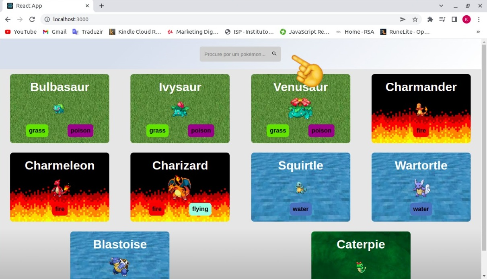

# Olá Treinador!

Se você chegou até aqui, significa que leu o README anterior e conseguiu rodar o projeto em sua máquina local.

Bom, para facilitar sua jornada, vou deixar aqui alguns links para você acessar e verificar os detalhes de alguns pokémons. Lembrando que a rota para a página de detalhes é acessada através de ***`'/pokemon/:nome-do-pokemon'`*** e a home é simplesmente ***`'/'`***.

### Pois vamos lá!

Primeiramente, ao rodar no seu terminal o comando `yarn start`, você possivelmente foi direcionado ao [localhost:3000](http://localhost:3000/) . 

Bom, essa é a nossa homepage.

Ela mostrará os cards de 10 pokémons! 😲 Mas calma, não é só isso.

Se você rolar até o final da página, automáticamente irá carregar mais 10 pokémons para você olhar, e assim por diante. É uma quantidade quase infinita de pokémons! Isso não é emocionante? 🥲

Além disso, você pode facilmente acessar os detalhes de um pokémon tanto clicando nesses cards quanto pesquisando na barra de pesquisa no cabeçalho.

### Mas calma lá que tem mais!

Você consegue também acessar a página de detalhes diretamente pela URL (lembrando do detalhe da rota '/pokemon/:nome-do-pokemon').

Para demonstrar isso, aqui vão 3 links que te levarão para a página de detalhes desses pokémons:

 * [Bulbasaur](http://localhost:3000/pokemon/bulbasaur) 🌿
 * [Charmander](http://localhost:3000/pokemon/charmander) 🔥
 * [Squirtle](http://localhost:3000/pokemon/squirtle) 💧

E ai, qual dos 3 você mais gostou? 😆

Não se esqueça de olhar na **página de detalhes** para escolher o pokémon que você mais se identifica!

Lá você vai encontrar, além do nome e do tipo do pokémon:

  1) Suas habilidades.
  2) Os 5 principais ataques.
  3) As suas características físicas, como altura e peso, e por fim
  4) Os status iniciais desse pokémon.

<strong>Legal, não?!</strong> Além de conferir o nome, a imagem, e o(s) tipo(s) do pokémon, você consegue verificar também o quão forte e parrudo ele é.

Espero que tenha gostado desse pequeno tutorial e espero vê-lo em breve, treinador! *E cuidado com a equipe rocket*.

Até mais!
🚀
